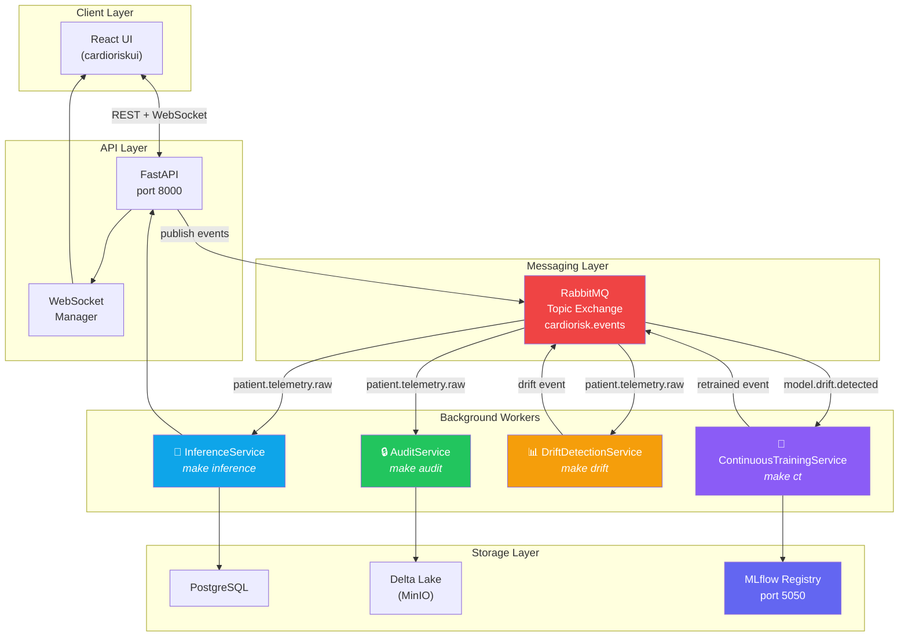
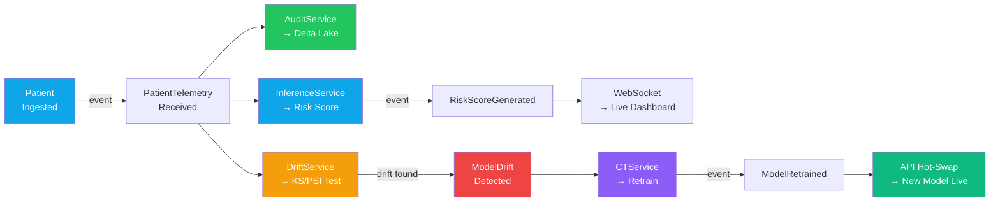
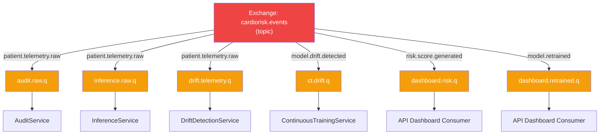

# Background Workers — Overview

This document provides a high-level overview of all 4 background workers in the CardioRisk XAI system. Each worker is an independent RabbitMQ consumer that processes domain events asynchronously.

## System Architecture



## Worker Summary

| # | Worker | Command | Queue | Listens For | Publishes | Tier |
|---|--------|---------|-------|-------------|-----------|------|
| 1 | [AuditService](./01_audit_service.md) | `make audit` | `audit.raw.q` | `patient.telemetry.raw` | `AuditLogWritten` | Compliance |
| 2 | [InferenceService](./02_inference_service.md) | `make inference` | `inference.raw.q` | `patient.telemetry.raw` | `RiskScoreGenerated` | Clinical |
| 3 | [DriftDetectionService](./03_drift_detection_service.md) | `make drift` | `drift.telemetry.q` | `patient.telemetry.raw` | `ModelDriftDetected` | MLOps |
| 4 | [ContinuousTrainingService](./04_continuous_training_service.md) | `make ct` | `ct.drift.q` | `model.drift.detected` | `ModelRetrained` | MLOps |

## Event Flow — Complete Chain



## Startup Order

```bash
# 1. Infrastructure (must be first)
make compose-up

# 2. Seed data + train model (one-time)
make seed-db
make train

# 3. API server
make dev

# 4. Workers (any order, separate terminals)
make audit          # Terminal 2
make inference      # Terminal 3
make drift          # Terminal 4
make ct             # Terminal 5

# 5. (Optional) Run thesis demo
make simulate-stream   # Terminal 6
```

## RabbitMQ Topology



> **Note:** Each queue has its own dead-letter queue (DLQ) for failed messages. The `BaseRabbitMQConsumer` handles manual acknowledgement, automatic retry, and DLQ routing.

## Common Patterns

All 4 workers share these patterns:

1. **`BaseRabbitMQConsumer`** — Base class providing connection management, manual ACK, DLQ routing, and graceful shutdown
2. **`RabbitMQPublisher`** — Shared publisher for emitting domain events
3. **Graceful shutdown** — `KeyboardInterrupt` triggers clean disconnection from RabbitMQ
4. **Environment-based config** — All settings via `.env` file (loaded with `python-dotenv`)
5. **Structured logging** — Consistent format: `timestamp | level | ServiceName | message`
