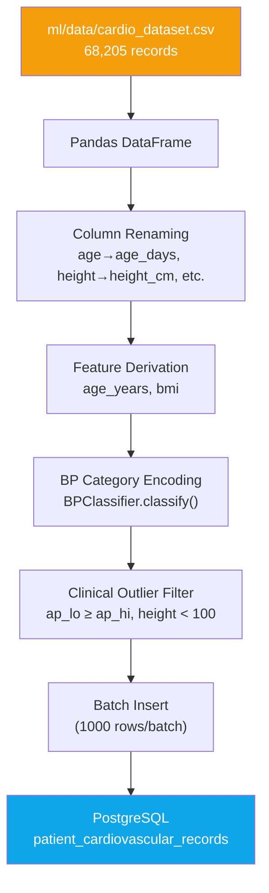
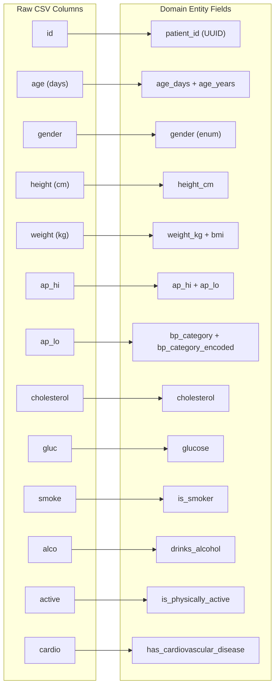

# Seed Database — Data Ingestion Pipeline

> **Command:** `make seed-db`
> **Runs:** `uv run python ml/pipelines/00_seed_postgres.py`

## Purpose

The seed pipeline is the **first step** in setting up the CardioRisk system. It loads the raw cardiovascular disease dataset (68K+ records from a Kaggle-derived CSV) into PostgreSQL, transforming raw columns into domain entities ready for ML training and API serving.

This is a **one-time operation** — run it once after `make compose-up` to populate the database.

## How It Works



## Data Transformation Pipeline



## Column Mapping

| CSV Column | Domain Field | Transform |
|-----------|-------------|-----------|
| `id` | `patient_id` | Generate fresh UUID |
| `age` | `age_days`, `age_years` | `age_years = age / 365.25` |
| `gender` | `gender` | 1=Female, 2=Male |
| `height` | `height_cm` | Direct cast |
| `weight` | `weight_kg` | Direct cast to float |
| `ap_hi` | `ap_hi` | Systolic blood pressure |
| `ap_lo` | `ap_lo` | Diastolic blood pressure |
| — | `bp_category` | Derived via `BPClassifier.classify(ap_hi, ap_lo)` |
| — | `bp_category_encoded` | 0=Normal, 1=Elevated, 2=HT1, 3=HT2, 4=Crisis |
| — | `bmi` | `weight_kg / (height_cm / 100)²` |
| `cholesterol` | `cholesterol` | 1=Normal, 2=Above Normal, 3=Well Above |
| `gluc` | `glucose` | 1=Normal, 2=Above Normal, 3=Well Above |
| `smoke` | `is_smoker` | 0/1 → bool |
| `alco` | `drinks_alcohol` | 0/1 → bool |
| `active` | `is_physically_active` | 0/1 → bool |
| `cardio` | `has_cardiovascular_disease` | 0/1 → bool (target variable) |

## Outlier Filtering

Records are skipped if they have clinically impossible values:

| Rule | Rationale |
|------|-----------|
| `ap_lo >= ap_hi` | Diastolic can't exceed systolic |
| `ap_hi > 250` | Exceeds clinical measurement range |
| `ap_hi < 60` | Below viable blood pressure |
| `height_cm < 100` | Below plausible adult height |
| `height_cm > 250` | Above plausible human height |

Typically ~6K records are filtered out, leaving ~62K clean records.

## Output

```
Seeding complete. Inserted=62174  Skipped=6031  Total=68205
```

## Prerequisites

- `make compose-up` (PostgreSQL must be running)
- `.env` configured with `DATABASE_URL`

## When to Use

- **Once**, after initial setup
- Again if you `docker compose down -v` (destroys volumes) and need to re-seed
