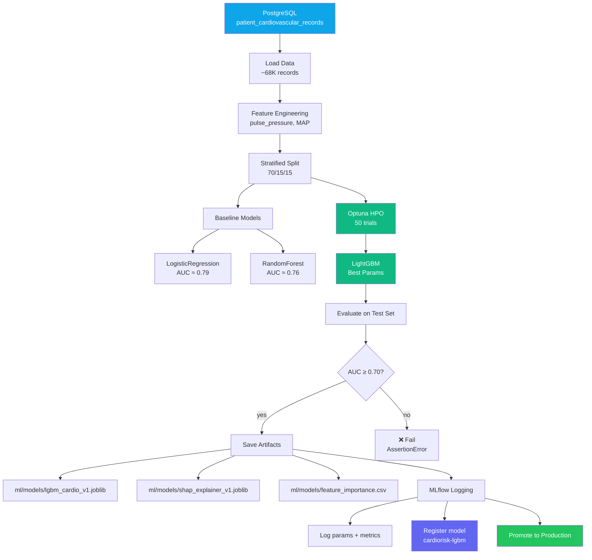
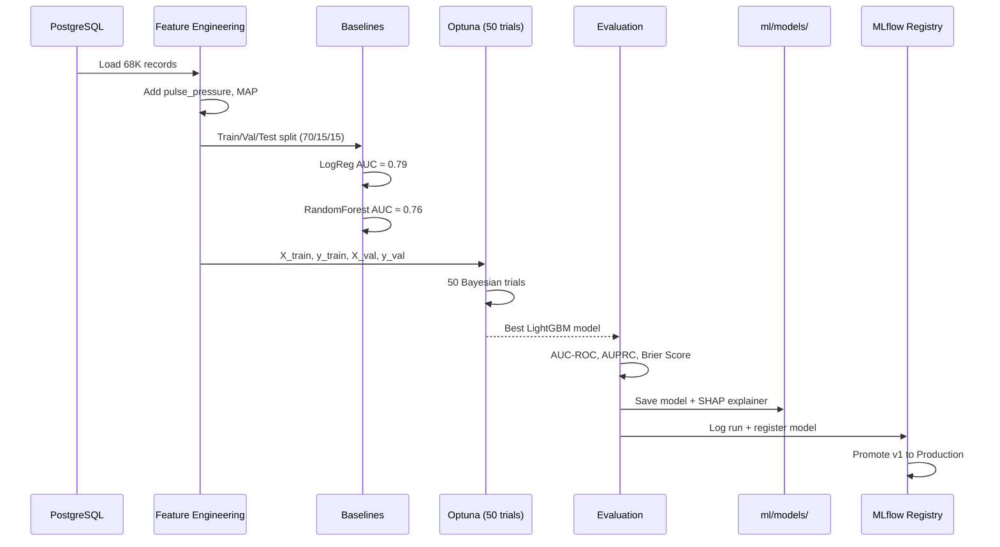
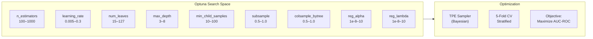
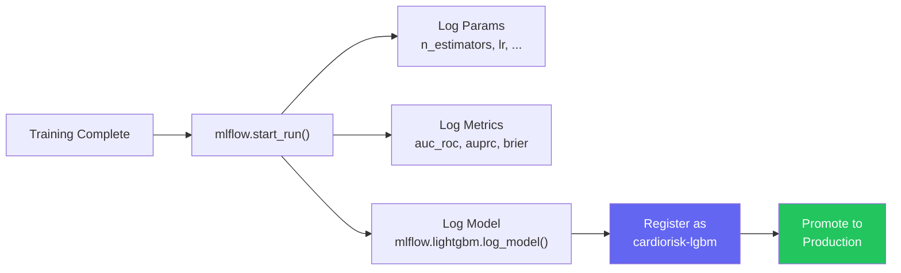

# Train LightGBM — Model Training Pipeline

> **Command:** `make train`
> **Runs:** `uv run python ml/pipelines/04_train_lgbm.py`

## Purpose

The training pipeline builds the core cardiovascular disease prediction model. It loads patient records from PostgreSQL, engineers features, runs Optuna Bayesian hyperparameter optimization with 50 trials, evaluates the final model against baselines, and registers the model in the MLflow registry.

This script is also **reused by the ContinuousTrainingService** (with 20 trials) for autonomous retraining after drift detection.

## How It Works

## Pipeline Stages

## Feature Engineering

15 features are used for training:

| # | Feature | Source | Type |
|---|---------|--------|------|
| 1 | `age_years` | `age_days / 365.25` | Continuous |
| 2 | `gender` | Raw | Binary (1=F, 2=M) |
| 3 | `height_cm` | Raw | Continuous |
| 4 | `weight_kg` | Raw | Continuous |
| 5 | `ap_hi` | Raw | Continuous (systolic BP) |
| 6 | `ap_lo` | Raw | Continuous (diastolic BP) |
| 7 | `cholesterol` | Raw | Ordinal (1-3) |
| 8 | `glucose` | Raw | Ordinal (1-3) |
| 9 | `is_smoker` | Raw | Binary |
| 10 | `drinks_alcohol` | Raw | Binary |
| 11 | `is_physically_active` | Raw | Binary |
| 12 | `bmi` | `weight / (height/100)²` | Derived |
| 13 | `pulse_pressure` | `ap_hi - ap_lo` | Derived |
| 14 | `mean_arterial_pressure` | `ap_lo + pp/3` | Derived |
| 15 | `bp_category_encoded` | BPClassifier | Derived (0-4) |

**Target:** `has_cardiovascular_disease` (binary: 0/1)

## Optuna Search Space

## Model Performance (Typical Results)

| Metric | Value | Threshold |
|--------|-------|-----------|
| **AUC-ROC** | 0.8007 | ≥ 0.70 (quality bar) |
| **AUPRC** | 0.7844 | — |
| **Brier Score** | 0.1803 | — |
| **Accuracy** | 0.74 | — |

### Top 10 Features by Gain

| Feature | Importance (Gain) |
|---------|:-:|
| `ap_hi` | ████████████████████ 247,636 |
| `age_years` | █████ 53,712 |
| `cholesterol` | ███ 28,931 |
| `mean_arterial_pressure` | ██ 16,475 |
| `bmi` | █ 10,171 |
| `bp_category_encoded` | █ 7,863 |
| `weight_kg` | █ 7,524 |
| `height_cm` | ▌ 3,680 |
| `glucose` | ▌ 3,487 |
| `is_physically_active` | ▎ 2,634 |

## Output Artifacts

| File | Content |
|------|---------|
| `ml/models/lgbm_cardio_v1.joblib` | Trained LightGBM model (serialized) |
| `ml/models/shap_explainer_v1.joblib` | SHAP TreeExplainer (pre-built for speed) |
| `ml/models/feature_importance.csv` | Feature importance table (gain + split) |
| MLflow Registry | `cardiorisk-lgbm` v1, stage: Production |

## MLflow Integration

After training, visit **http://localhost:5050** to see:
- Experiment runs with all hyperparameters
- Metrics comparison across runs
- Model artifacts stored in MinIO
- Model registry with version history

## Prerequisites

- `make compose-up` (PostgreSQL + MLflow + MinIO)
- `make seed-db` (data loaded)
- `.env` with `DATABASE_URL`, `MLFLOW_TRACKING_URI`, `AWS_ACCESS_KEY_ID`, `AWS_SECRET_ACCESS_KEY`

## When to Use

- **Once**, for initial model training
- **Again**, if you want to retrain with different parameters
- **Automatically**, called by the ContinuousTrainingService (with `n_trials=20`)
