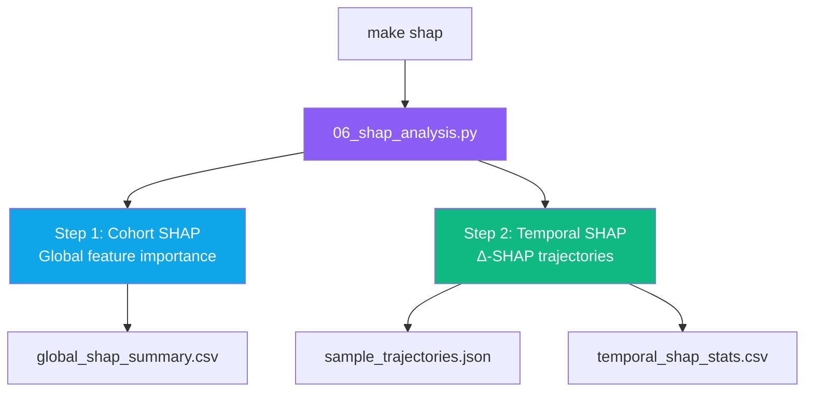
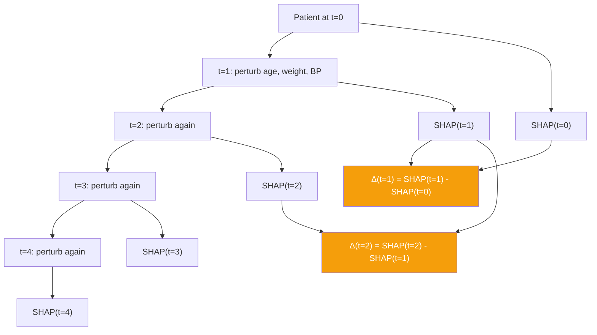

# SHAP Analysis — Explainability Pipeline

> **Command:** `make shap`
> **Runs:** `uv run python ml/pipelines/06_shap_analysis.py`

## Purpose

Generates **global and temporal explainability artifacts** for the trained LightGBM model. This is the thesis's core contribution: making CVD risk predictions transparent for clinicians.

Two types of analysis:
1. **Global cohort SHAP** — which features matter most across the population
2. **Temporal SHAP (Δ-SHAP)** — how each feature's influence changes over simulated time

## Pipeline Flow

## Temporal SHAP — Thesis Novelty

**Δ-SHAP** shows clinicians *how* feature influence changes: "Your blood pressure's impact on risk is growing — intervene now."

## Output Artifacts

| File | Content |
|------|---------|
| `ml/models/global_shap_summary.csv` | Feature importance rankings |
| `ml/models/sample_trajectories.json` | Temporal SHAP for sample patients |
| `ml/models/temporal_shap_stats.csv` | Aggregated temporal statistics |

## Prerequisites

- `make train` (trained model must exist)
- `make compose-up` (PostgreSQL running)
