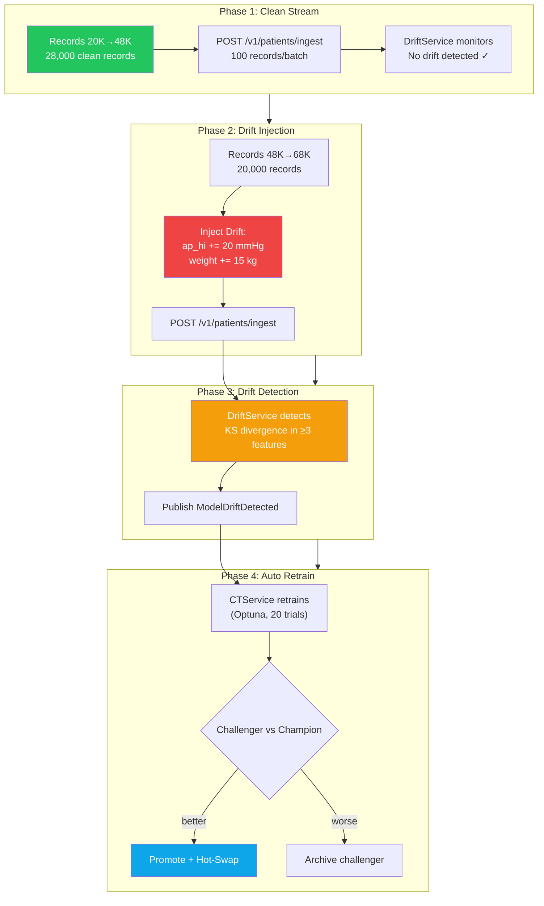

# Simulate Stream — Thesis Defence Demo

> **Command:** `make simulate-stream`
> **Runs:** `uv run python ml/pipelines/08_simulate_stream.py`

## Purpose

The thesis defence demo script. Simulates the full MLOps Continuous Training cycle end-to-end by streaming patient data through the API, injecting artificial drift, and watching the system autonomously detect, retrain, and hot-swap.

## 4-Phase Simulation



## Timeline

```mermaid
gantt
    title Thesis Demo Timeline
    dateFormat X
    axisFormat %s

    section Phase 1
    Clean stream (28K records)   :0, 180

    section Phase 2
    Drifted stream (20K records) :180, 300

    section Phase 3
    Drift detection              :300, 310

    section Phase 4
    Retrain (20 trials)          :310, 370
    Compare + Promote            :370, 375
    Hot-swap                     :375, 380
```



## Drift Injection Detail

| Feature | Original (Clean) | Drifted | Delta |
|---------|:-:|:-:|:-:|
| `ap_hi` (systolic BP) | ~128 mmHg | ~148 mmHg | +20 |
| `weight` | ~74 kg | ~89 kg | +15 |

This simulates a realistic clinical scenario: the hospital starts seeing sicker, heavier patients (e.g., seasonal surge, referral pattern change).

## Prerequisites

All 4 workers must be running:

```bash
make dev              # Terminal 1: API
make inference        # Terminal 2: InferenceService
make drift            # Terminal 3: DriftDetectionService
make ct               # Terminal 4: ContinuousTrainingService
```

## How to Run

```bash
# Terminal 5:
make simulate-stream

# Terminal 6 (optional): Watch the UI
cd cardioriskui && npm run dev
# Open http://localhost:5173/mlops
```

## What to Monitor

| Where | What to Watch |
|-------|--------------|
| **simulate-stream terminal** | Phase progress, polling for model version change |
| **drift terminal** | `DRIFT DETECTED` message with drifted feature list |
| **ct terminal** | `PROMOTED` or `NOT PROMOTED` with AUC comparison |
| **MLflow UI** (localhost:5050) | New model version, metrics comparison |
| **API** (`curl localhost:8000/v1/mlops/status`) | Model version change |
| **React UI** (`localhost:5173/mlops`) | Live status cards, registry table, timeline |

## Expected Output

```
═══ Phase 1: Clean Stream (records 20000→48000) ═══
[CLEAN] Batch 0-100/28000 sent (ok=100, err=0)
...
Phase 1 complete: 28000 records in 180.0s

═══ Phase 2: Drift Injection (records 48000→68000, ap_hi+20, weight+15) ═══
[DRIFTED] Batch 0-100/20000 sent (ok=100, err=0)
...
Phase 2 complete: 20000 records in 120.0s

═══ Phase 3-4: Waiting for Drift Detection → CT Cycle ═══
Polling for model version change (timeout 5 minutes)...

═══ MODEL HOT-SWAPPED ═══
  Old version: v1
  New version: v2
═══ Thesis demo complete! ═══
```
