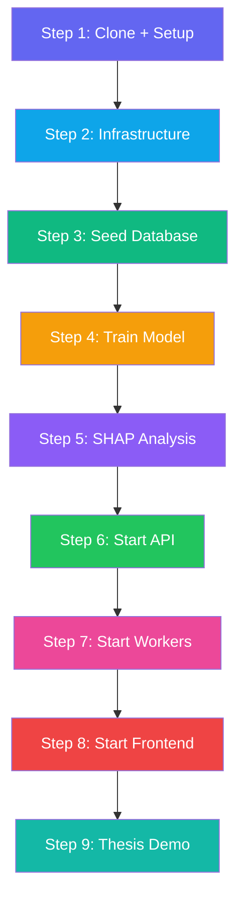
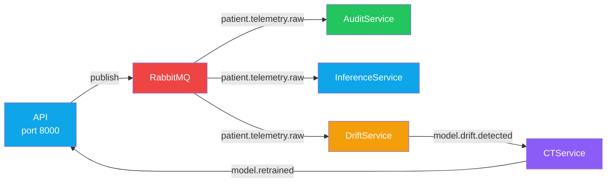
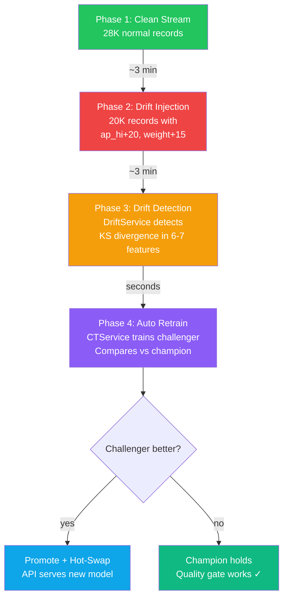

# CardioRisk XAI — Complete End-to-End Guide

> **Start from absolute zero → thesis defence demo in ~30 minutes**

This guide walks through every step to set up, run, and demonstrate the full CardioRisk XAI system. Follow the steps in order.

---

## Prerequisites

| Tool | Version | Install |
|------|---------|---------|
| Python | 3.11+ | Managed by `uv` |
| [uv](https://docs.astral.sh/uv/) | Latest | `curl -LsSf https://astral.sh/uv/install.sh \| sh` |
| Docker + Compose | Latest | [docker.com](https://www.docker.com/products/docker-desktop/) |
| Node.js | 18+ | [nodejs.org](https://nodejs.org/) (for frontend) |
| OpenRouter API Key | — | [openrouter.ai/keys](https://openrouter.ai/keys) |

---

## Full Pipeline Overview



---

## Step 1: Clone + Environment Setup

```bash
git clone <your-repo-url> cardioriskapi
cd cardioriskapi

# Create .env from template
cp .env.example .env

# ⚠️  Edit .env — add your OpenRouter API key:
#   OPENROUTER_API_KEY=sk-or-v1-xxxxx

# Install everything
make setup
```

**What this does:**
- Creates a Python 3.11 virtual environment (`.venv/`)
- Installs all dependencies (ML, API, messaging, explainability, etc.)
- Generates `uv.lock` for reproducibility

**Verify:** `.venv/bin/python --version` → `Python 3.11.x`

📖 *No detailed notebook for this step — it's a one-liner.*

---

## Step 2: Start Infrastructure

```bash
make compose-up
```

**What this does:** Starts 4 Docker containers:

| Container | Port | UI |
|-----------|------|----|
| PostgreSQL 16 | `localhost:5432` | — |
| RabbitMQ 3.13 | `localhost:5672` (AMQP) | [localhost:15672](http://localhost:15672) (guest/guest) |
| MinIO (S3) | `localhost:9000` (API) | [localhost:9001](http://localhost:9001) (minioadmin/minioadmin) |
| MLflow | `localhost:5050` | [localhost:5050](http://localhost:5050) |

**Verify:** All containers show `Healthy` / `Running`

> ⚠️ **macOS note:** Port 5000 is used by AirPlay Receiver. MLflow is mapped to **5050** to avoid conflict.

📖 *No detailed notebook — infrastructure is fully automated via Docker Compose.*

---

## Step 3: Seed the Database

```bash
make seed-db
```

**What this does:**
- Reads `ml/data/cardio_dataset.csv` (68,205 records)
- Renames raw columns to domain fields (`age` → `age_days`, etc.)
- Derives `bmi`, `age_years`, `bp_category` from raw values
- Filters clinical outliers (impossible BP, extreme heights)
- Bulk-inserts ~62K clean records into PostgreSQL

**Verify:**
```bash
# Should return ~62K
curl -s http://localhost:8000/v1/patients?page=1\&per_page=1 | python3 -m json.tool
# Or check DB directly:
docker exec cardiorisk_postgres psql -U cardiorisk_user -d cardiorisk -c "SELECT COUNT(*) FROM patient_cardiovascular_records;"
```

📖 **Detailed docs:** [05_seed_database.md](./05_seed_database.md)

---

## Step 4: Train the Model

```bash
make train
```

**What this does:**
1. Loads data from PostgreSQL
2. Engineers features (pulse_pressure, MAP)
3. Trains baseline models (LogReg, RandomForest)
4. Runs **LightGBM + Optuna HPO** (50 trials, ~15 minutes)
5. Evaluates on test set (AUC-ROC ≈ 0.80)
6. Saves model + SHAP explainer to `ml/models/`
7. Registers model in **MLflow** as `cardiorisk-lgbm` v1 → Production

**Expected output:**
```
AUC-ROC : 0.8007
AUPRC   : 0.7844
Brier   : 0.1803
Quality bar passed: AUC-ROC=0.8007 >= 0.70
MLflow: model v1 promoted to Production
=== Training complete ===
```

**Verify:** Open [localhost:5050](http://localhost:5050) → see experiment run with metrics

📖 **Detailed docs:** [06_train_lightgbm.md](./06_train_lightgbm.md)

---

## Step 5: SHAP Analysis

```bash
make shap
```

**What this does:**
1. **Global cohort SHAP** — ranks features by mean |SHAP| across the population
2. **Temporal SHAP** — simulates how feature influence changes over time (Δ-SHAP)

**Outputs:**
- `ml/models/global_shap_summary.csv`
- `ml/models/sample_trajectories.json`
- `ml/models/temporal_shap_stats.csv`

📖 **Detailed docs:** [07_shap_analysis.md](./07_shap_analysis.md)

---

## Step 6: Start the API

```bash
make dev
```

**What this does:**
- Starts FastAPI on [localhost:8000](http://localhost:8000)
- Hot-reload enabled for development
- Serves REST endpoints + WebSocket for live risk alerts
- Consumes `ModelRetrained` events for automatic hot-swap

**Verify:** Open [localhost:8000/docs](http://localhost:8000/docs) → interactive OpenAPI docs

**Key endpoints:**

| Method | Endpoint | Description |
|--------|----------|-------------|
| `POST` | `/v1/patients/ingest` | Ingest new patient |
| `GET` | `/v1/patients/{id}/risk` | Risk + LLM narrative |
| `GET` | `/v1/patients/{id}/shap` | SHAP attributions |
| `GET` | `/v1/patients/{id}/trajectory` | Temporal SHAP |
| `GET` | `/v1/mlops/status` | Current model + drift status |
| `GET` | `/v1/mlops/models` | Model registry |
| `WS` | `/v1/patients/{id}/live` | Real-time risk stream |

---

## Step 7: Start Background Workers

Open **4 separate terminals** and run one command in each:

```bash
# Terminal 2:
make audit          # AuditService → writes to Delta Lake

# Terminal 3:
make inference      # InferenceService → ML + SHAP + LLM pipeline

# Terminal 4:
make drift          # DriftDetectionService → KS/PSI monitoring

# Terminal 5:
make ct             # ContinuousTrainingService → auto retrain
```

**How they connect:**



**Verify:** Each terminal shows `Consumer started: queue=...`

📖 **Detailed docs:**
- [00_workers_overview.md](./00_workers_overview.md) — architecture + topology
- [01_audit_service.md](./01_audit_service.md)
- [02_inference_service.md](./02_inference_service.md)
- [03_drift_detection_service.md](./03_drift_detection_service.md)
- [04_continuous_training_service.md](./04_continuous_training_service.md)

---

## Step 8: Start the Frontend

```bash
# In a new terminal:
cd ../cardioriskui
npm install      # first time only
npm run dev
```

**What this does:**
- Starts React UI on [localhost:5173](http://localhost:5173)
- Connects to the API at `localhost:8000`

**Key pages:**

| Page | URL | Shows |
|------|-----|-------|
| Dashboard | `/` | Patient list, live risk alerts |
| Patient Detail | `/patients/{id}` | Risk gauge, SHAP waterfall, LLM narrative, trajectory |
| MLOps | `/mlops` | Model status, drift chart, registry, retrain timeline |

---

## Step 9: Run the Thesis Demo

```bash
# Terminal 6 (back in cardioriskapi):
make simulate-stream
```

**What happens (4 phases):**



**Where to watch during the demo:**

| Terminal | What to Watch |
|----------|--------------|
| `simulate-stream` | Phase progress, record counts |
| `drift` | `DRIFT DETECTED — KS drifted features: [...]` |
| `ct` | `PROMOTED` or `NOT PROMOTED` with AUC comparison |
| Browser: [localhost:5173/mlops](http://localhost:5173/mlops) | Live model status, drift chart, registry |
| Browser: [localhost:5050](http://localhost:5050) | MLflow experiment runs, model versions |

📖 **Detailed docs:** [08_simulate_stream.md](./08_simulate_stream.md)

---

## Quick Reference — All Commands

| Step | Command | Duration | Terminal |
|------|---------|----------|---------|
| Setup | `make setup` | ~30s | Any |
| Infrastructure | `make compose-up` | ~15s | Any |
| Seed DB | `make seed-db` | ~30s | Any |
| Train | `make train` | ~15 min | Any |
| SHAP | `make shap` | ~2 min | Any |
| API | `make dev` | ongoing | Terminal 1 |
| Audit Worker | `make audit` | ongoing | Terminal 2 |
| Inference Worker | `make inference` | ongoing | Terminal 3 |
| Drift Worker | `make drift` | ongoing | Terminal 4 |
| CT Worker | `make ct` | ongoing | Terminal 5 |
| Frontend | `cd ../cardioriskui && npm run dev` | ongoing | Terminal 6 |
| Thesis Demo | `make simulate-stream` | ~10 min | Terminal 7 |

## Tear Down

```bash
# Stop all workers: Ctrl+C in each terminal

# Stop infrastructure:
make compose-down

# Destroy all data (volumes):
docker compose down -v
```

---

## Troubleshooting

| Problem | Solution |
|---------|----------|
| Port 5000 in use (MLflow) | macOS AirPlay — we use port 5050 instead |
| `ModuleNotFoundError: boto3` | `uv pip install boto3` |
| DriftService: `Could not parse SQLAlchemy URL` | Ensure `.env` has `DATABASE_URL` set |
| Validation error `age=0` | CSV delimiter issue — ensure `pd.read_csv()` uses comma |
| CT stuck in retrain loop | Purge queue: `curl -u guest:guest -X DELETE http://localhost:15672/api/queues/%2F/ct.drift.q/contents` |
| OpenRouter 401 | Check `OPENROUTER_API_KEY` in `.env` — LLM narrative falls back to rule-based |

---

## Notebook Index

| File | Topic |
|------|-------|
| **[00_workers_overview.md](./00_workers_overview.md)** | System architecture, RabbitMQ topology |
| [01_audit_service.md](./01_audit_service.md) | `make audit` — Delta Lake compliance |
| [02_inference_service.md](./02_inference_service.md) | `make inference` — ML + SHAP + LLM |
| [03_drift_detection_service.md](./03_drift_detection_service.md) | `make drift` — KS/PSI drift detection |
| [04_continuous_training_service.md](./04_continuous_training_service.md) | `make ct` — Retrain + champion/challenger |
| [05_seed_database.md](./05_seed_database.md) | `make seed-db` — CSV → PostgreSQL |
| [06_train_lightgbm.md](./06_train_lightgbm.md) | `make train` — Optuna HPO + MLflow |
| [07_shap_analysis.md](./07_shap_analysis.md) | `make shap` — Global + Temporal SHAP |
| [08_simulate_stream.md](./08_simulate_stream.md) | `make simulate-stream` — Thesis demo |
